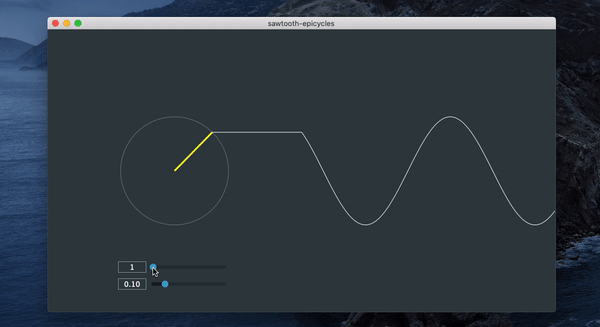

# Drawing a sawtooth wave
This application draws the first partial sums of the Fourier series approximating a sawtooth wave. It is heavily inspired by Daniel Shiffman's coding challenge on [Fourier Series](https://github.com/CodingTrain/website/blob/main/CodingChallenges/CC_125_Fourier_Series/P5/sketch.js) and adds functionality to control frequency (in Hz) and the N partial sums.

